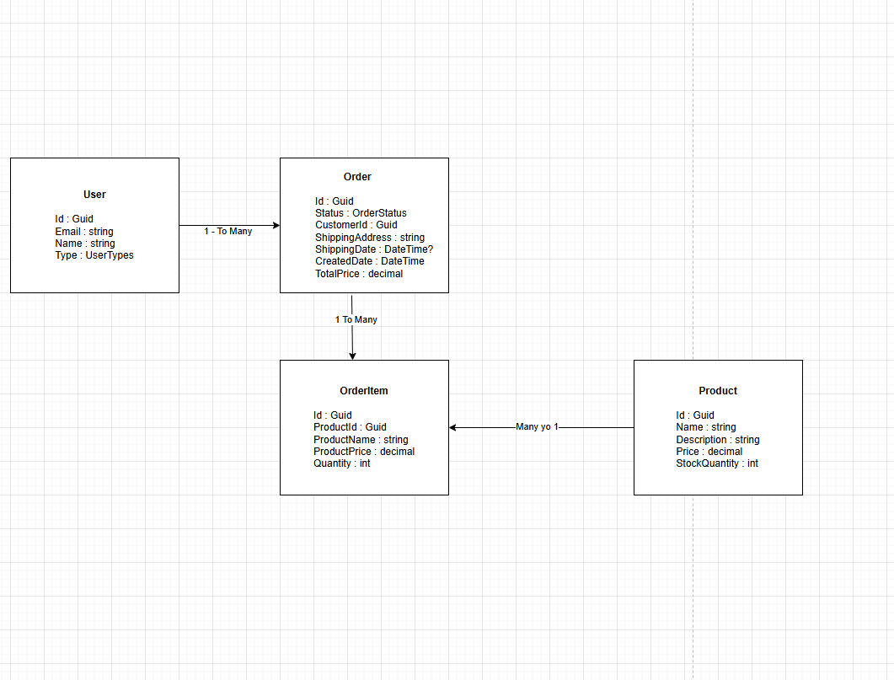

# Sample Project

## Features

### User
- CreateUser
- UpdateUser
- DeleteUser
- GetUser
- GetUsers
- DeleteAllUsers
- GetUsersByTag

** Limitation - Not placing Authorization for User controller so that initial postman setup can work. However we can do it by creating a user of type Admin directly in the database first. 

### Product
- Create Product
    - Admin only 
- Update Product
    - Admin Only
- Get Product By Id
    - Accessible to all
- List All Products
    - Accessible to all
- Delete Product
    - Admin only
- Clear
    - Admin only

** Limitations 
- Have not implemented Get Product By Name. But it is straight    
               forward and can be done.
- For now we are only considering Admin and Customers. Normally in a company there are other users who are responsible for different things based on their role. But right now roles are not implemented.               

### Order
- Create (Place Order)
    - Creates an Order and a customer if not existing. 
- UpdateOrderStatus
    - The only thing we allow updating is the status.
    - Only Admin/Customer and that too depending on what is the current status.
- GetOrder By Id
    - Admin / Customer who placed the order can access.
- GetOrders
    - Admin only.
- GetOrdersForCustomer
    - Admin / Customer who placed the order can access.

** Limitations
- I have not implemented an additional Cart feature which would have enabled customers to create a draft order which has not been submitted yet. This would have allowed customers to add/remove items from the cart till the time he is ready to submit.
- The current functionality assumes that customer is done selecting whatever he/she wants and is going to send the order. The order gets created in a Pending status
- Also only following Order statuses are being supported
    - Pending = 1, //order submitted 
    - Processing = 2, //only Admin  
    - Cancelled = 3, //cancellation can only happen if the order is in Pending/- - Processing Status
    - Shipped = 4, //only Admin
    - Delivered = 5, //only Admin - or - might be application from a trusted carrier like UPS, USPS, FedEx etc.        
    - ReturnRequested = 6, // ReturnRequested can only happen if the order is - - Delivered - Only Admin
    - Returned = 7 // Return can only be done by Admin
- Not considering any payment related statuses
- When an Order is placed, we need to supply CustomerEmail. To remove this limitation we will need to add a Cart functionality which allows people to start adding orders without need to specify their email or logging in.
- When an order is created, the system checks for the customer email provided. If the customer email doesnot exist, a new user of type customer gets created.

## Authorization
- Very naive form of Authentication being used.
- We expect a header field named "UserId" in the request.
Depending on the value of this header field, we check the database and find out if the user is Admin or a Customer. Based on that we allow/deny access to a particular resource.
- See [CustomAuthFilter.cs](./SampleProject/WebApi/Filters/CustomAuthFilter.cs) file.  

** Limitation - Authorization only being tested for Products and Orders. For User controller not checking the authorization which obviously we will not do in the real time scenario &#9786;

## Logging 
Not Implemented for this poc, but can be done by injecting the ILogger and using Serilog or any other logging library. 

## Unit Testing
Implemented for 
- CreateOrderService [CreateOrderServiceTests](./SampleProject/Tests/Core.Test/CreateOrderServiceTests.cs)
- UpdateOrderService [UpdateOrderServiceTests](./SampleProject/Tests/Core.Test/UpdateOrderServiceTests.cs)

## Postman Setup
Assuming an admin with id 9422740e-6426-4c46-8445-3f5274a62424 present in the system.
- Postman Collection File is [PostmanCollectionFile](LendingPad-SampleProject.postman_collection.json)

- 1.  Run APIs under the Initialize Sample Data

**  If you Deleted or Changed the Type of the user with id 9422740e-6426-4c46-8445-3f5274a62424. Then please do one the following
    - Create a new Admin User and collect its guid and set the postman Global variable "AdminIdForAuthorization" to  this new Guid  
       <b>Or</b>  
    - Just Run the Post Api Named "Create User Mark" under "Initialize Sample Data"

- 2. Run APIs under Tasks
- 3. Under Requests Folder
    - Products
        - Create Product-1
        - Create Product-2
        - Create Product - 3 UnAuthorized (This checks Authorization)
        - Update Product
        - Get Product - 1
        - Get Product - 2 - By Id
        - List All Products
        ** Do Not Delete the Products, as Orders Depends on them. You Can test the Delete Functionality After Orders have been Tested

    - Order
        - Order 1 - Requests listed under this Folder it are Dependent on Product-1 created above
        - Order 2 - Requests listed under this Folder are Dependent on Product-2 created above
        - Order 3 - Requests listed under this Folder are Dependent on both Product-1 and Produc-2 created above
    - List All Orders - Admin , this request lists all the Orders present and is avaialble only to Admin (Which is passed in the UserId header from the gloabl variable "AdminIdForAuthorization" )
    - List All Orders - Customer, this request lists all the Orders for a particular customer and is accessible to customer and Admin. Here we are passing the UserId of Customer in the "UserID" header of the request using "newCustomerId1" variable of Postman Global collection.            

## Entity Relationship

** <b>While User gets saved in Raven DB, the Orders, OrderItems and Products are in memory lists.</b> 
** We are considering Customers to be a type of user andstoring them with admins and company's system users. May be storing them in a different table, a better design.  

